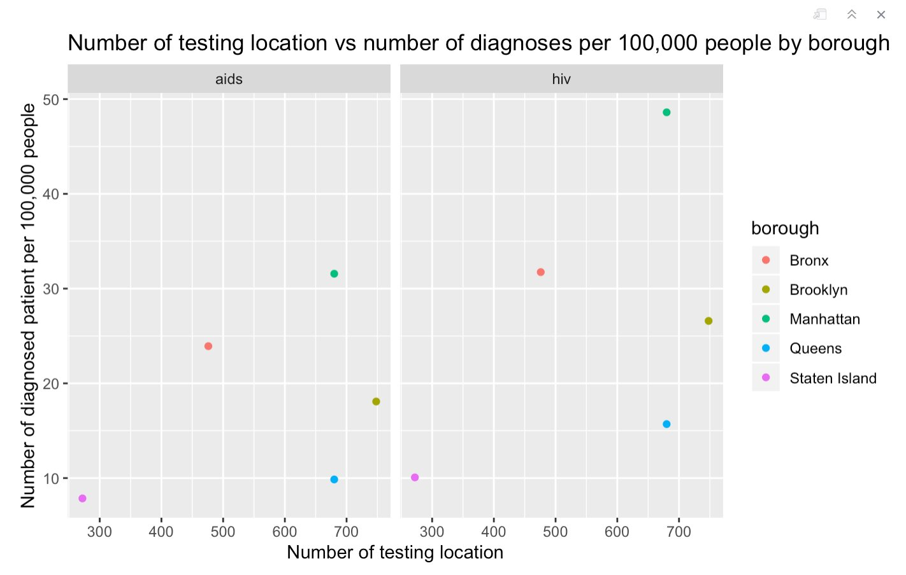

Xiaoyue Ma (xm2229) / Chuyue Xiang (cx2227)/ Harsha Senapathi (svs2130)

## Background
Acquired immunodeficiency syndrome (AIDS) is a chronic, potentially life-threatening condition caused by the human immunodeficiency virus (HIV). There are about 200,000 cases per year in the U.S. An HIV infection can progress to AIDS, but the right treatment and certain precautions can prevent this from happening. HIV testing is an effective way to diagnose early and prevent progression to AIDS, and there are certain locations that provide HIV testing. In this project, we narrowed our focus in NYC, and we wanted to see whether there were influential factors that would impact the HIV/AIDS diagnoses rates in NYC.

## Data Sources
There are three datasets that we are using in this project: the HIV testing locations dataset and the HIV/AIDS Diagnoses by Neighborhood, Sex, and Race/Ethnicity dataset, and New York Neighborhoods by boroughs.The first two datasets are available on NYC Open Data. 

The HIV testing locations dataset contains location and facility information for places in New York City that provide HIV testing. You can access to this data [here](https://data.cityofnewyork.us/Health/HIV-Testing-Locations/72ss-25qh).

The HIV/AIDS Diagnoses by Neighborhood, Sex, and Race/Ethnicity dataset includes data on new diagnoses of HIV and AIDS in NYC for the calendar years 2010 through 2013. You can access to this data [here](https://data.cityofnewyork.us/Health/HIV-AIDS-Diagnoses-by-Neighborhood-Sex-and-Race-Et/ykvb-493p).

New York Neighborhoods by boroughs. You can access this data [here](https://www.baruch.cuny.edu/nycdata/population-geography/neighborhoods.htm).

## Methods
Originally, we had two datasets, one shows HIV/AIDS diagnoses by Neighborhood, sex and race/ethinicity, and the other one shows the the information of HIV/AIDS testing centers in the five boroughs in the New York City. We wanted to build a connect between the two datasets. So we found the third dataset - New York Neighborhoods by boroughs. We incorporated the third dataset and divided the neighborhoods in the first dataset into five boroughs. From there, we were able to see the HIV/AIDS diagnoses data and the information of testing locations in one dataset. In this process, there are some N/A data, we filtered all samples with empty information. So, in the raw dataset, there were 2928 samples, after the data cleaning, there are 2856 samples. 

To explore the trend of HIV/AIDS in NYC, We first compared the HIV diagnoses rates and AIDS diagnoses rates in each borough and the testing locations in each borough. Then we wanted to see the relationship between the number of HIV/AIDS on testing locations that provided free or low cost testing and the diagnosis rates, but we did not have sufficient data to uniformly compare between the boroughs or over different years. So, this test will not be shown in the analysis section. Next, we created an interactive graph of the HIV/AIDS diagnoses rates in each borough from 2010-2013. 

## Analysis

### Is there a relationship between the rates of diagnoses of HIV and the number of HIV testing locations, by borough?

In order to better understand the trend of HIV/AIDS diagnoses, we thought it would be interesting to see the relationship between its diagnoses rates in each borough and the number of testing locations. So, we created variables shows the HIV diagnoses number per 100,000 people and AIDS diagnoses number per 100,000 people in each borough, and the number of testing locations in each borough. Below are the plots showing the relationships.

Clearly from both of the plots, there is no significant linear relationship. However, since we only have five data points, it is very hard to conclude if there is really a significant linear relationship between number of testing location and number of HIV/AIDS diagnoses in each borough. However, one interesting finding is that while other boroughs all have slightly higher HIV diagnoses rates, Manhattan has a significantly higher rate of HIV diagnoses rate than aids, which may need more study.

From visualizing using the graphs in flex dashboard we can see there is a decrease in the number of HIV and AIDS through the years. 

